# 📌 Spedok
> 강아지 용품 쇼핑몰 프로젝트 (1인)

<br>

## 🔍 제작 기간 & 참여 인원
- 2024.09 ~ 2024.11
- 개인 프로젝트

<br>

## 🔍 사용 기술 :
- Java 21
- Spring Boot 3.2.10
- Spring Security
- JPA 
- QueryDSL 5.0.0
- Rest API
- MySQL 8.0
- H2 DB Embedded
- Docker

<br>

## 🔍 ERD
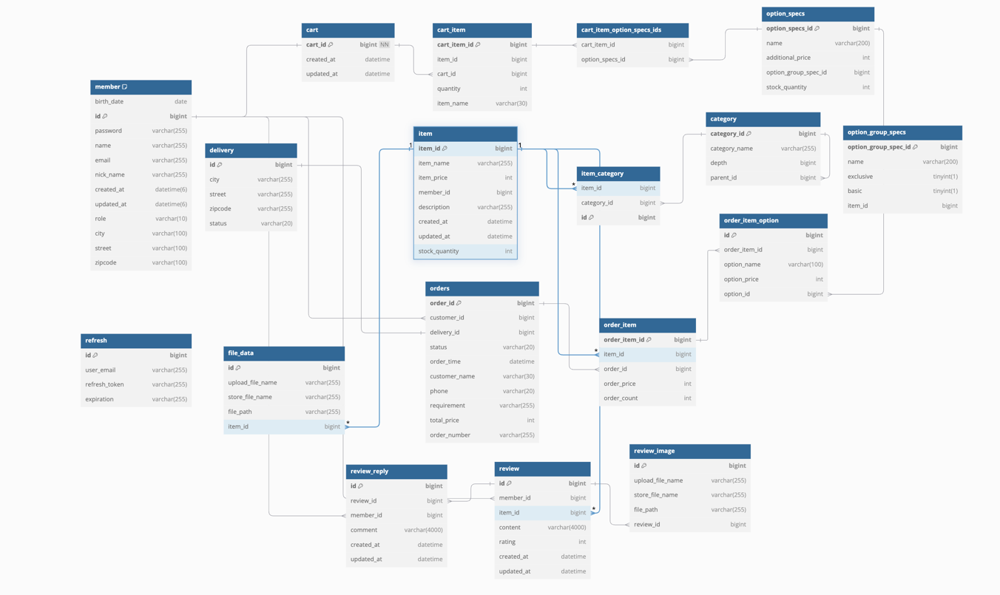


<br>


## 🔍 아키텍처
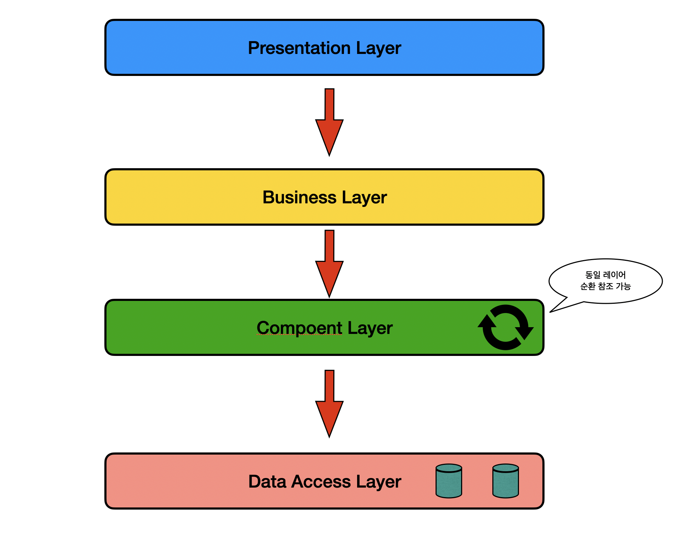

Business Layer (Service Layer) 을 두 레이어로 나누었습니다 <br>
Compoent 계층이 Data 계층 (Repository) 계층과 통신하고 <br>
비지니스 레이어는 Compoent 계층을 조립하도록 아키텍처를 설계하였습니다 <br>

**이와 같은 설계를 한 이유는 두 가지 이유가 있습니다.**

* 하나의 비지니스 레이어에 모든 로직을 넣으면 전체적인 로직의 흐름을 한 눈에 보기 어렵다는 점이 있었습니다
* 단위 테스트의 의미를 생각해 봤을때 각 API의 전체적인 흐름을 단위별로 쪼개서 테스트 함이라고 생각합니다
* 그렇다면 Compoent 계층에서 작은 단위의 로직으로 구성하고 이 단위를 테스트하는게 좋은 테스트라고 생각하였습니다. 


<br>


## 🔍 핵심 기술 :


<details>
<summary>JWT 로그인 API</summary>

#### 회원가입
> 1. 이메일, 닉네임, 비밀번호 중복 검증
> 2. 패스워드 암호화
> 3. 장바구니 객체 생성
> 4. 회원 DB 저장

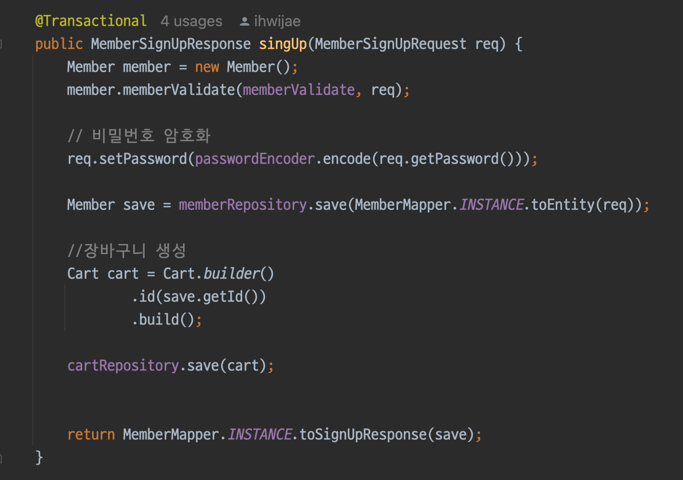

<br>

#### 스프링 시큐리티 JWT를 통한 로그인 전체 로직

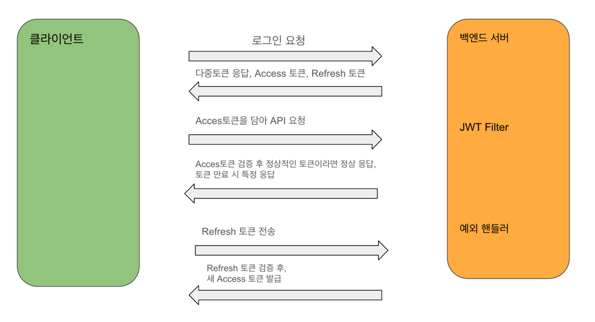

<br>

#### jwt 토큰 생성
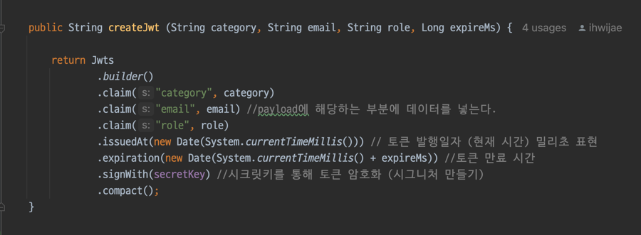

<br>

#### 로그인 성공시 동작하는 핸들러
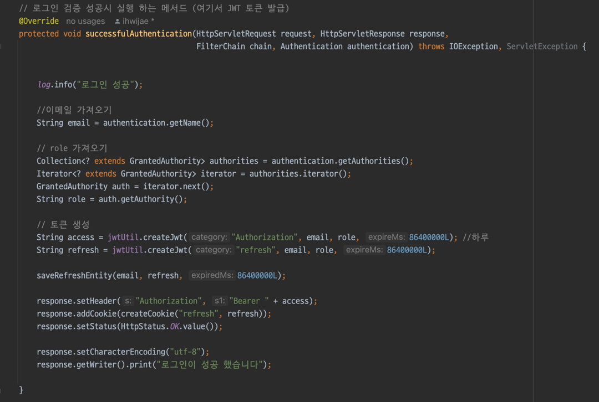

<br>


#### 토큰 검증
```java

 @Override
    protected void doFilterInternal(HttpServletRequest request, HttpServletResponse response, FilterChain filterChain) throws ServletException, IOException {

        // 요청에서 access토큰 헤더 가져오기
        String authorization = request.getHeader("Authorization");
        log.info(authorization);

        // 토큰이 없다면 다음 필터로 넘긴다.
        if(authorization == null || !authorization.startsWith("Bearer ")) {

            filterChain.doFilter(request, response); //권한이 필요 없는 요청도 있을수 있기 때문에 다음 필터로 넘겨야한다.
            return; //메서드 종료
        }

        // Bearer 공백 제거.
        String accessToken = authorization.split(" ")[1];


        // 토큰 만료 여부 체크, 확인 시 다음 필터로 넘기지않는다
        try {
            jwtUtil.isExpired(accessToken);
        } catch (ExpiredJwtException e) {

          response.getWriter().print("access token expired");

            response.setStatus(HttpServletResponse.SC_UNAUTHORIZED);
            return;
        }

        // 토큰 카테고리 확인 (access 인지 체크 토큰 발급시 페이로드에 명시했다.)
        String category = jwtUtil.getCategory(accessToken);

        if(!category.equals("Authorization")) {

            response.getWriter().print("Invalid access token");
            response.setStatus(HttpServletResponse.SC_UNAUTHORIZED);
            return;
        }

        // email, role 값을 꺼내와서 일시적인 세션 생성
        String userEmail = jwtUtil.getUserEmail(accessToken);
        String role = jwtUtil.getRole(accessToken);

        log.info("여기도 셀렉트 쿼리?");
        Member findMember = memberRepository.findByEmail(userEmail)
                .orElseThrow(() -> new UsernameNotFoundException("User not found"));


//        Member member = Member.authorization(userEmail, null, Authority.valueOf(role));
        CustomUserDetails customUserDetails = new CustomUserDetails(findMember.getId(), memberRepository);

        Authentication authToken = new UsernamePasswordAuthenticationToken(customUserDetails, null, customUserDetails.getAuthorities());
        SecurityContext context = SecurityContextHolder.getContext();
        context.setAuthentication(authToken);

        log.info("authToken = {}", authToken);
        log.info("context = {}", context.getAuthentication());
        log.info("userEmail = {}", userEmail);

        filterChain.doFilter(request, response);


    }
```

<br>

#### 로그아웃
> 1. Refresh 토큰을 받아 쿠키 초기화
> 2. DB에 저장한 Refresh 토큰 삭제

```java
    private void doFilter(HttpServletRequest request, HttpServletResponse response, FilterChain filterChain) throws IOException, ServletException {


        response.setCharacterEncoding("utf-8");

        //path and method verify
        String requestUri = request.getRequestURI();

        if (!requestUri.matches("^\\/logout$")) {

            filterChain.doFilter(request, response);
            return;
        }

        String requestMethod = request.getMethod();
        if (!requestMethod.equals("POST")) {

            filterChain.doFilter(request, response);
            return;
        }


        Cookie[] cookies = request.getCookies();

        if (cookies == null) {
            response.getWriter().write("쿠키가 존재하지 않습니다");
            response.setStatus(HttpServletResponse.SC_BAD_REQUEST);
            return;
        }

        Cookie resultCookie = Arrays.stream(cookies)
                .filter(cookie -> cookie.getName().equals("refresh"))
                .findAny()
                .orElse(null);

        String refresh = resultCookie.getValue();


        //refresh null check
        if (refresh == null) {

            response.setStatus(HttpServletResponse.SC_BAD_REQUEST);
            return;
        }

        //expired check
        try {
            jwtUtil.isExpired(refresh);
        } catch (ExpiredJwtException e) {

            //response status code
            response.setStatus(HttpServletResponse.SC_BAD_REQUEST);
            return;
        }

        // 토큰이 refresh인지 확인 (발급시 페이로드에 명시)
        String category = jwtUtil.getCategory(refresh);
        if (!category.equals("refresh")) {

            response.getWriter().write("토큰이 refresh 토큰이 아닙니다");
            //response status code
            response.setStatus(HttpServletResponse.SC_BAD_REQUEST);
            return;
        }

        //DB에 저장되어 있는지 확인
        Boolean isExist = refreshRepository.existsByRefreshToken(refresh);
        if (!isExist) {

            response.getWriter().write("데이터베이스에 존재하지 않습니다.");
            //response status code
            response.setStatus(HttpServletResponse.SC_BAD_REQUEST);
            return;
        }

        //로그아웃 진행
        //Refresh 토큰 DB에서 제거
        refreshRepository.deleteByRefreshToken(refresh);

        //Refresh 토큰 Cookie 값 0
        Cookie cookie = new Cookie("refresh", null);
        cookie.setMaxAge(0);
        cookie.setPath("/");

        response.addCookie(cookie);


        response.getWriter().write("로그아웃 했습니다");
        response.setStatus(HttpServletResponse.SC_OK);
    }
```


<br>

#### 로그인


</details>

<details>
<summary>주문 API</summary>

### 주문 로직 전체흐름
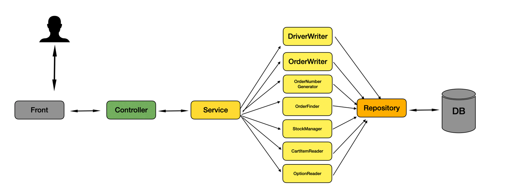


#### 주문생성
> 1. 배송지 생성
> 2. 재고 확인
> 3. 재고 처리
> 4. 주문 번호 생성 (UUID 조합)
> 5. 장바구니 존재 유무 검증
> 6. 최종 주문 생성
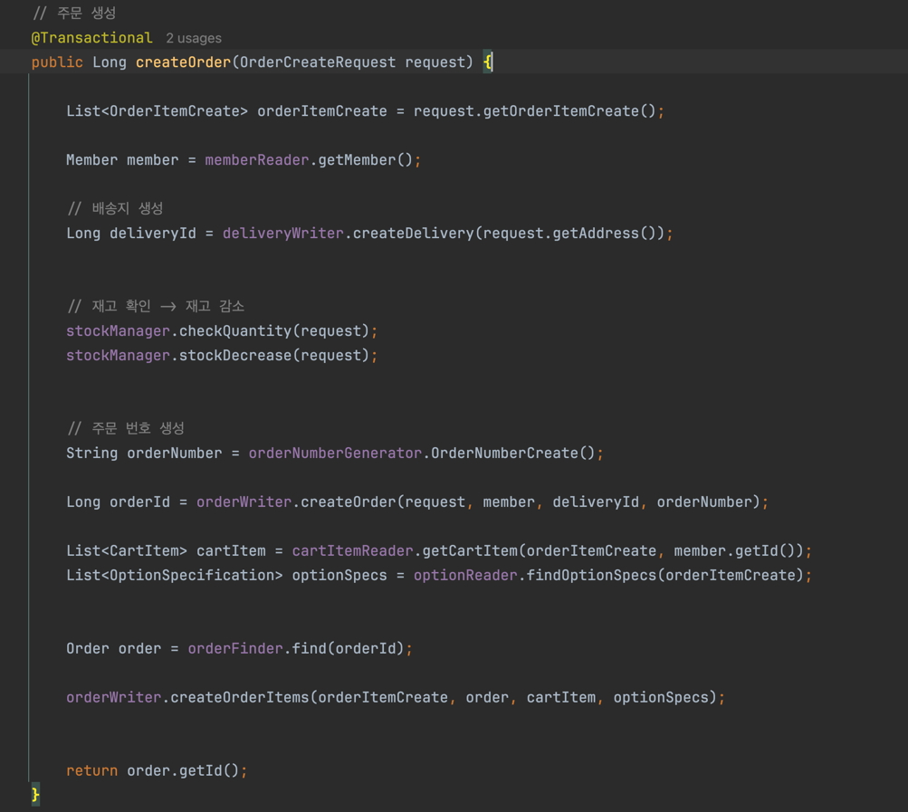


<br>

#### 주문취소
> 1. 주문 상태 검증
> 2. 주문 상태 변경
> 3. 재고 복원
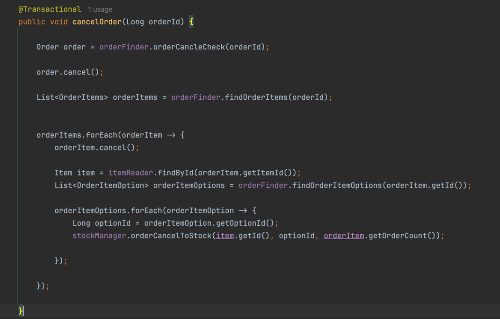
</details>


<details>
<summary>상품 API</summary>

### 상품 로직 전체 흐름
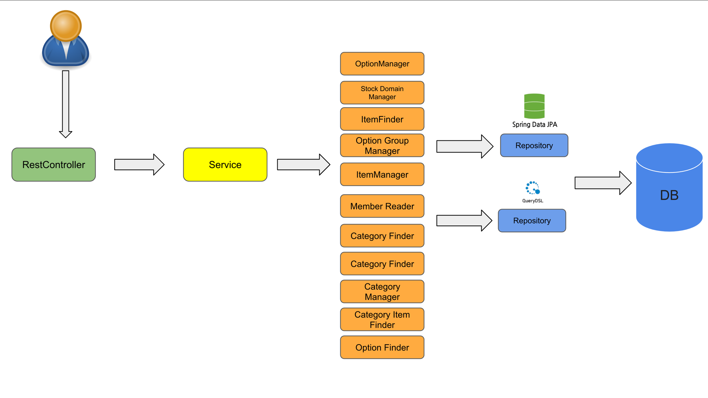


####  상품 등록
> 1. 상품 생성을 누르면 임시 상품 DB에 저장 후 PK 반환
> 2. 상품 이름 검증 (중복 검증)
> 3. Request DTO 내부에 ID를 꺼내 임시 상품 조회
> 4. 해당 상품에 각종 정보 저장 (등록자, 이름, 가격 등등)
> 5. 요청 정보에서 카테고리 ID를 조회해 카테고리 등록
> 6. 요청 정보에서 옵션 ID를 조회해 옵션 정보 등록

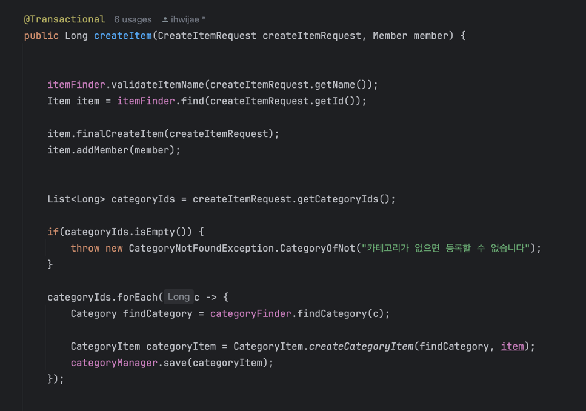
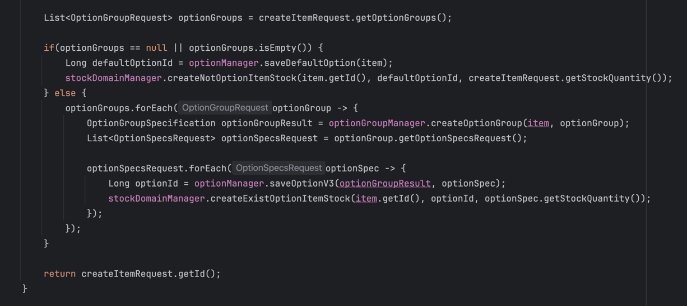

<br>
<br>

#### 상품 전체 조회
- 페이징 기능
- 상품을 조회는 빈번히 일어난다고 생각하여 캐시 처리
- 커버링 인덱스 사용하여 페이징 성능 최적화

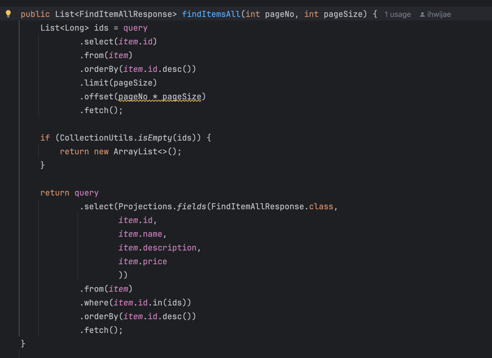

<br>
<br>

#### 상품 검색
- 상품 검색 기능

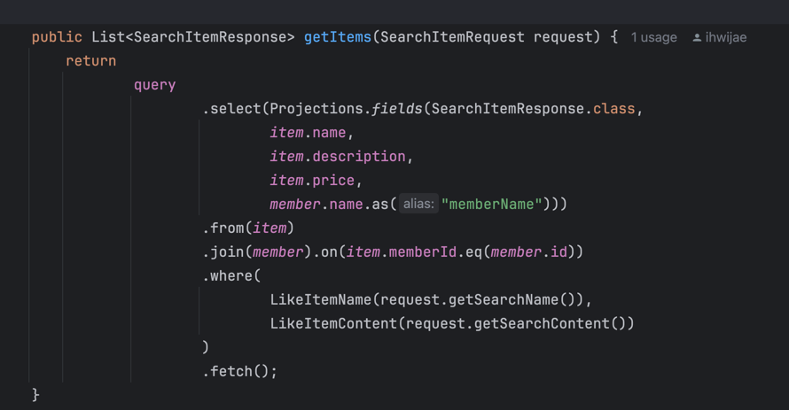

<br>
<br>

#### 상품 수정
> 1. 상품 이름 검증
> 2. 파라미터로 넘어온 ID로 DB에서 상품과 사용자를 조회
> 3. 상품을 등록한 사용자인지 검증
> 4. 상품 수정
> 5. 상품 옵션 수정

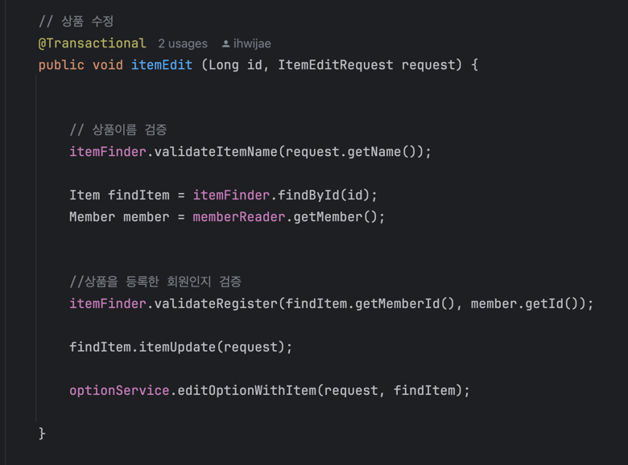

<br>
<br>

#### 상품 삭제
> 1. 상품을 등록한 사용자 인지 검증
> 2. 카테고리 상품 삭제
> 3. 상품 옵션 삭제
> 4. 상품 삭제

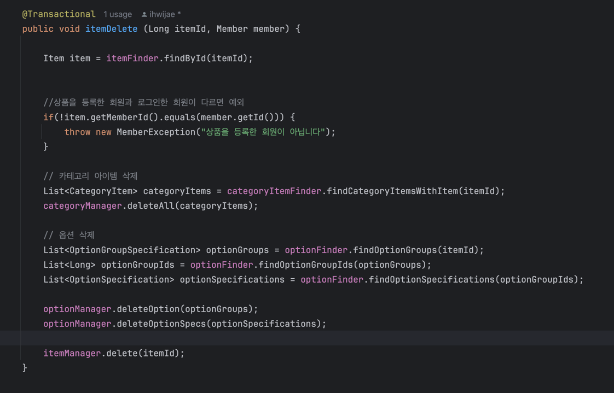

<br>
<br>

#### 상품 상세 조회
- 컬렉션 조회 시 N+1 문제를 해결하기 위해 최적화


```java
   public ItemDetailResponse itemDetail(Long itemId) {

        ItemDetailResponse itemDetail = repository.findItemDetail(itemId);


        // 컬렉션 조회
        Map<Long, List<OptionGroupResponse>> optionGroups = repository.findOptionGroups(itemDetail.getId());

        List<Long> optionGroupIds = optionGroups.values().stream()
                .flatMap(List::stream)
                .map(OptionGroupResponse::getId)
                .collect(Collectors.toList());

        Map<Long, List<OptionSpecsResponse>> optionSpecs = repository.findOptionSpecs(optionGroupIds);

        Map<Long, List<CategoryResponse>> categories = repository.findCategories(itemDetail.getId());


        optionGroups.values()
                .forEach(g ->
                        g.forEach(group -> group.setOptionSpecs(optionSpecs.get(group.getId()))));

        itemDetail.setCategory(categories.get(itemDetail.getId()));
        itemDetail.setOptionGroup(optionGroups.get(itemDetail.getId()));

        return itemDetail;
    }
```

</details>

<details>
<summary>리뷰 API</summary>

### 리뷰 로직 전체 흐름
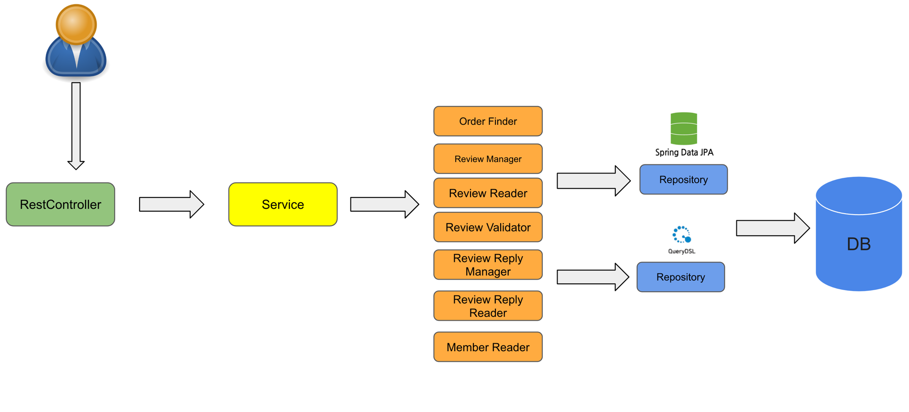


#### 리뷰 전체조회 (댓글포함)
- 댓글, 대댓글을 따로 조회해서 서비스 단에서 조립하는 방식 채택

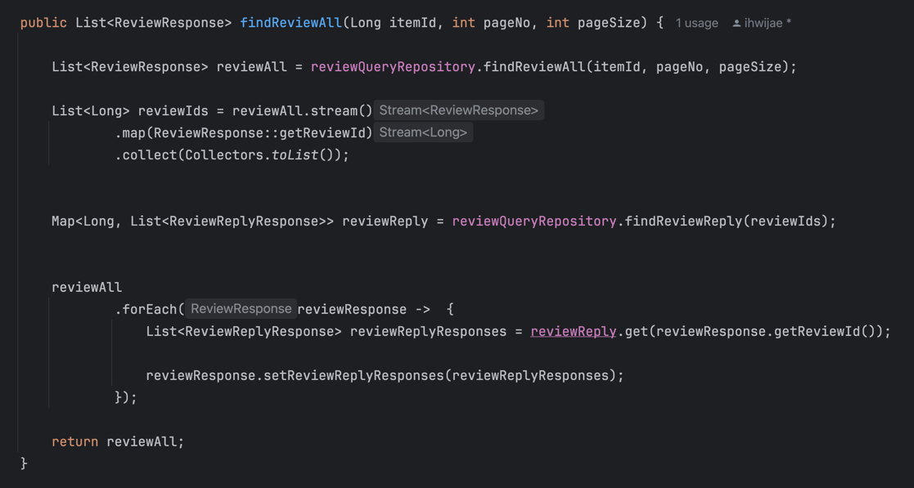


<br>

#### 리뷰 작성
> 1. 상품을 주문한 회원이 맞는지 검증
> 2. 상품 임시 생성 후 pk 반환
> 3. 반환 받은 pk로 리뷰 생성

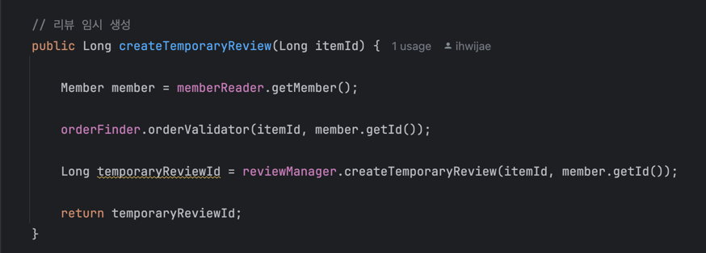
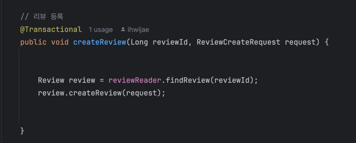


<br>

#### 리뷰 수정
> 1. 리뷰를 작성한 회원이 맞는지 검증
> 2. 파라미터로 받은 reviewId로 Review 객체 조회
> 3. 반환받은 Review 객체 수정

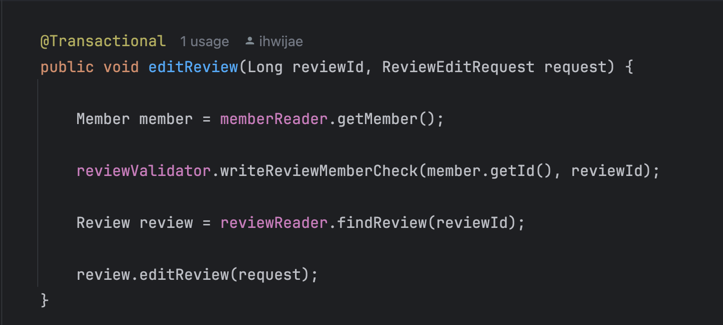

<br>

#### 리뷰 삭제
> 1. 인자로 받은 reviewId로 Review 객체 조회
> 2. 리뷰를 작성한 회원인지 검증
> 3. 인자로 받은 reviewId로 ReviewReply 객체 조회
> 4. Review, ReviewReply 삭제

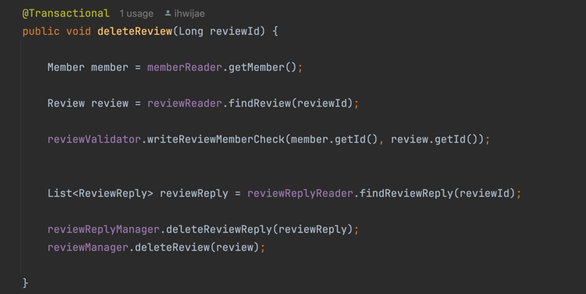

</details>


<details>
<summary>카테고리 API</summary>

#### 카테고리 별 상품 조회

- 카레고리별 상품을 조회할때 커버링 인덱스를 활용하여 조회성능 최적화


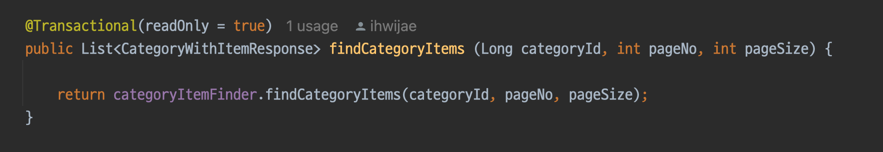

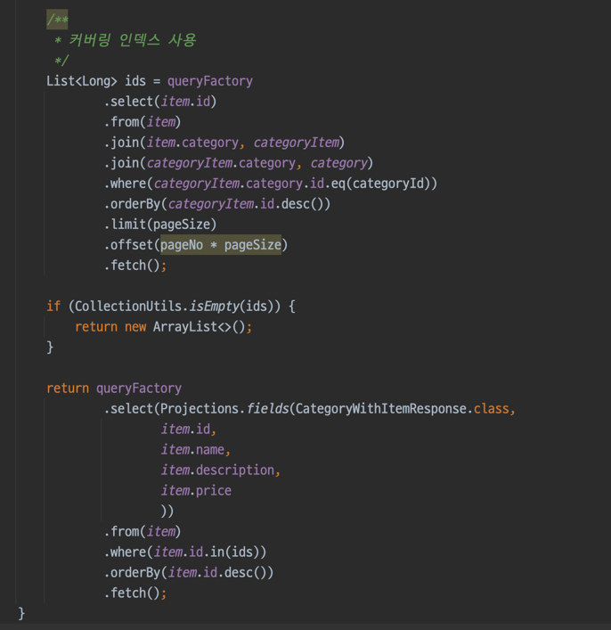


</details>

<details>
<summary>파일 API</summary>

#### 파일 API 전체 흐름
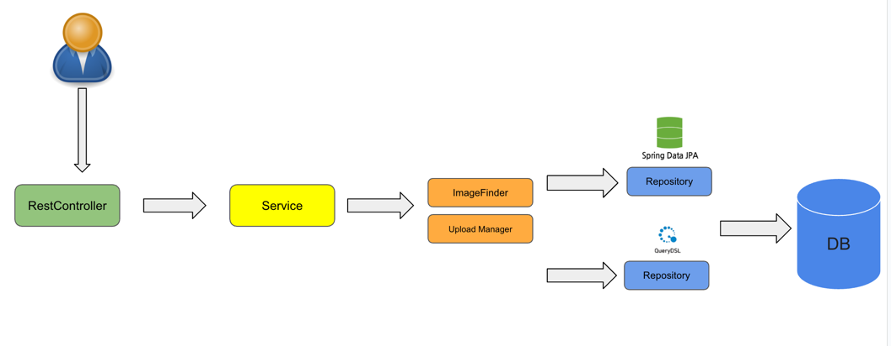

<br>

#### 단일 이미지 업로드
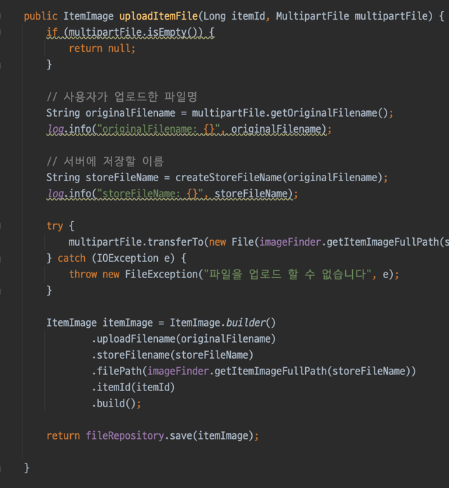

<br>

#### 여러 이미지 업로드
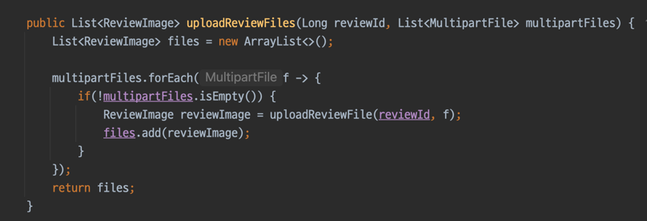


</details>


<details>
<summary>옵션 API</summary>

#### 상품을 생성할때 옵션이 없을때 기본 옵션 생성
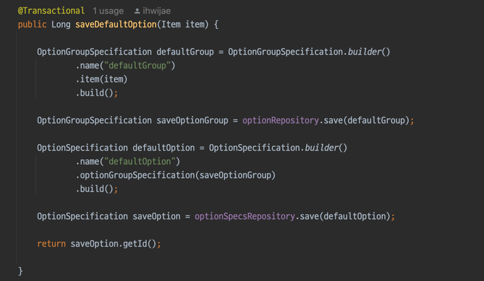

<br>


#### 옵션에는 옵션그룹, 옵션스펙이 존재한다

#### 상품을 생성할때 옵션이 있는 경우 옵션 생셩
- 옵션 그룹 생성

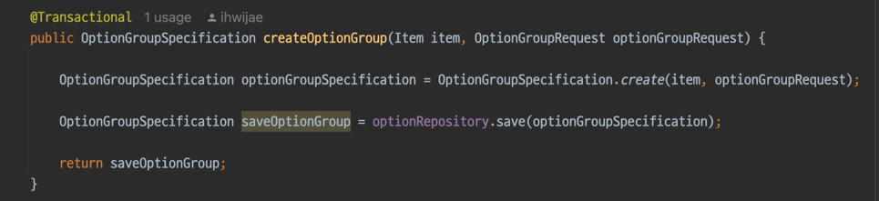

- 옵션 상세 내용 생성

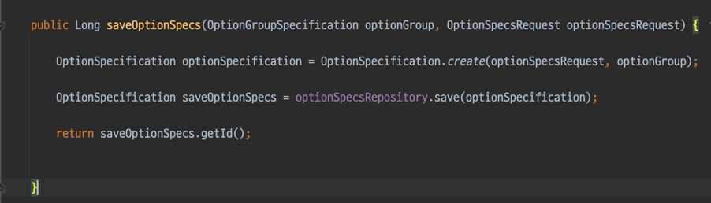

</details>


<br>


## 🔍 트러블 슈팅 

#### JPA 연관관계 매핑 시 N+1 문제
> JPA를 사용하니 연관관계를 직접적으로 사용하는것이 좋겠다 싶어 양방향 매핑을 지향했다.  
> 하지만 기능을 수정,보완 하면서 도메인이 늘어나고 그에따라 매핑을 해주다보니, 관계가 복잡해지고 의도하지않은 쿼리가 자꾸 발생했다.    


> 어떤 객체들을 객체 참조 관계로 가져갈 것인지에 대해 여러 시도를 해보다가 나름대로 가이드를 정했다   
> 첫째, 함께 생성되고 함께 삭제되는 객체들을 함께 묶었다 라이프사이클이 동일한 객체를 참조관계로 설정했다   
> 둘째, 도메인 제약사항을 함께 공유하는 객체들을 묶었다   
> 가능하면 분리해서 간접참조로 설정했다  

#### 단방향 @OneToMany, @JoinColumn Update 쿼리
> 양방향 연관관계를 풀어주기위해 최대한 단방향 매핑으로 변경했다  
> 하지만 쓸데없는 Update 쿼리가 발생했다    
> 
> 관계형 DB 관점에서 보면 FK를 Many쪽에서 관리하는게 보통이다.  
> 즉, 엔티티가 관리하는 외래키가 다른 테이블에 존재하는 것.  
> 따라서 연관관계 관리를 위해 추가적으로 생성,수정,삭제시 Update쿼리가 발생한다


#### 해결방안
> 라이프사이클이 완전히 동일하지 않은 객체들끼리는 단방향 ManyToOne 으로 관계를 설정하고 Join을 활용  
> 그 외는 ID 매핑으로 직접 Join 쿼리를 사용했다.

<br>

#### 컬렉션 조회 최적화
> 여러개의 상품의 조회할때 ( ex)전체 아이템조회, 카테고리별 아이템 조회 등등..) 단일 조회시에는 해당 x   
> N+1 문제 발생 조회하는 아이템의 갯수마다 N+1 쿼리가 실행된다 .  
> 조회하는 아이템이 10개라면 컬렉션을 조회하는 10번의 쿼리가 추가로 발생한다.  

```java
    public List<ItemDetailResponse> itemDetail(Long itemId) {
        List<ItemDetailResponse> itemDetail = findItemDetail(itemId);
        itemDetail.forEach(
                itemDetailResponse -> {


                    List<OptionGroupResponse> optionGroup = findOptionGroup(itemId);
                    List<CategoryResponse> categoryResponses = findCategory(itemId);
                    itemDetailResponse.setCategory(categoryResponses);
                    itemDetailResponse.setOptionGroup(optionGroup);

                    optionGroup.forEach(optionGroupResponse -> {
                        List<OptionSpecsResponse> optionSpecs = findOptionSpecs(optionGroupResponse.getId());
                        optionGroupResponse.setOptionSpecs(optionSpecs);
                    });
                }
        );
        return itemDetail;
    }
```
#### 이처럼 컬렉션안에 컬렉션이 존재하는경우 반복문을 통해 조회해서 주입해주는 방식 이었다

```java
    public List<ItemDetailResponse> findByItemDetail(Long itemId) {

        //루트 조회
        List<ItemDetailResponse> itemDetail = findItemDetail(itemId);

        // optionGroup, optionSpecs 컬렉션을 Map 으로 한방에 조회
        Map<Long, List<OptionGroupResponse>> optionGroupMap = findOptionGroupMap(toOptionGroupIds(itemDetail));
        Map<Long, List<OptionSpecsResponse>> optionSpecsMap = findOptionSpecsMap(toOptionSpecsIds(itemDetail));

        //루프를 돌면서 컬렉션 추가 (추가 쿼리 실행 xx)
        itemDetail.forEach(
                itemDetailResponse -> {
                    itemDetailResponse.setOptionGroup(optionGroupMap.get(itemDetailResponse.getId()));

                }
        );

    }
```

#### 이렇게 Map안에 값을 List로 담아 한번에 조회하여 조회 성능을 최적화 했습니다.


