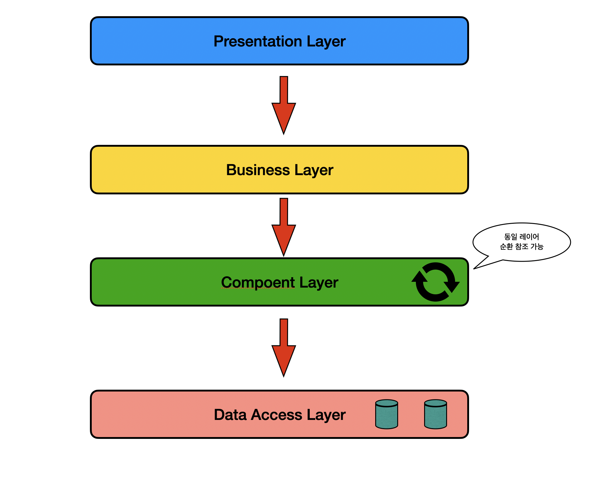

# 📌 Spedok
> 강아지 용품 쇼핑몰 프로젝트 (1인)

 

## 🔍 제작 기간 & 참여 인원
- 2024.09 ~ 2024.11
- 개인 프로젝트

 

## 🔍 사용 기술 :
- Java 21
- Spring Boot 3.2.10
- Spring Security
- JPA 
- QueryDSL 5.0.0
- Rest API
- MySQL 8.0
- H2 DB Embedded
- Docker

 

## 🔍 ERD

 

## 🔍 아키텍처

Business Layer (Service Layer) 을 두 레이어로 나누었습니다  
Compoent 계층이 Data 계층 (Repository) 계층과 통신하고  
비지니스 레이어는 Compoent 계층을 조립하도록 아키텍처를 설계하였습니다  

**이와 같은 설계를 한 이유는 두 가지 이유가 있습니다.**

* 하나의 비지니스 레이어에 모든 로직을 넣으면 전체적인 로직의 흐름을 한 눈에 보기 어렵다는 점이 있었습니다
* 단위 테스트의 의미를 생각해 봤을때 각 API의 전체적인 흐름을 단위별로 쪼개서 테스트 함이라고 생각합니다
* 그렇다면 Compoent 계층에서 작은 단위의 로직으로 구성하고 이 단위를 테스트하는게 좋은 테스트라고 생각하였습니다. 

## 🔍 핵심 기술 :

주문 API

### 주문 로직 전체흐름

#### 주문생성
> 1. 배송지 생성
> 2. 재고 확인
> 3. 재고 처리
> 4. 주문 번호 생성 (UUID 조합)
> 5. 장바구니 존재 유무 검증
> 6. 최종 주문 생성

 

#### 주문취소
> 1. 주문 상태 검증
> 2. 주문 상태 변경
> 3. 재고 복원

