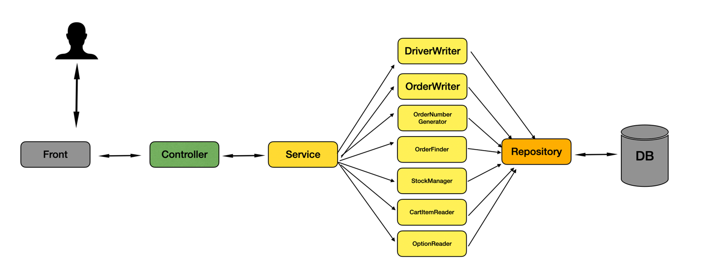

# 📌 Spedok
> 강아지 용품 쇼핑몰 프로젝트 (1인)

 

## 🔍 제작 기간 & 참여 인원
- 2024.09 ~ 2024.11
- 개인 프로젝트

 

## 🔍 사용 기술 :
- Java 21
- Spring Boot 3.2.10
- Spring Security
- JPA 
- QueryDSL 5.0.0
- Rest API
- MySQL 8.0
- H2 DB Embedded
- Docker

 

## 🔍 ERD

 

## 🔍 핵심 기술 :

주문 API

### 주문 로직 전체흐름

- 주문 생성
  1. 배송지 생성
  2. 재고 확인 (재고가 없거나, 부족하면 예외 처리)
  3. 주문 번호 생성 (UUID 조합)
  4. 장바구니에 존재하는 상품인지 검증
  5. 최종 주문 생성

- 

