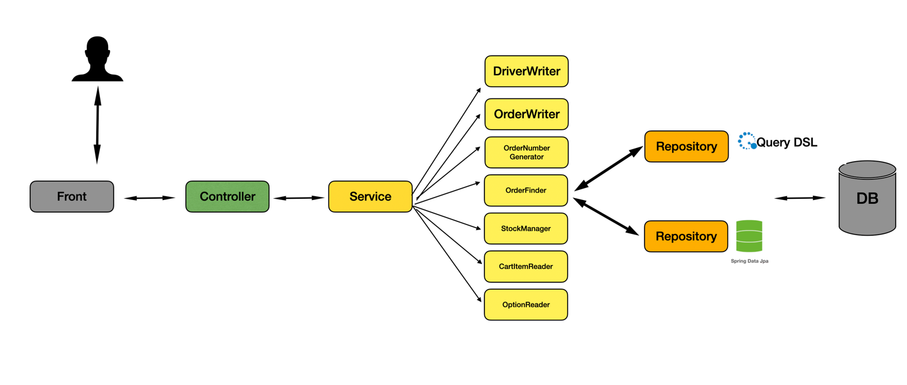

# 📌 Spedok
> 강아지 용품 쇼핑몰 프로젝트 (1인)

<br>

## 🔍 제작 기간 & 참여 인원
- 2024.09 ~ 2024.11
- 개인 프로젝트

<br>

## 🔍 사용 기술 :
- Java 21
- Spring Boot 3.2.10
- Spring Security
- JPA 
- QueryDSL 5.0.0
- Rest API
- MySQL 8.0
- H2 DB Embedded
- Docker

<br>

## 🔍 ERD


<br>


## 🔍 아키텍처


Business Layer (Service Layer) 을 두 레이어로 나누었습니다 <br>
Compoent 계층이 Data 계층 (Repository) 계층과 통신하고 <br>
비지니스 레이어는 Compoent 계층을 조립하도록 아키텍처를 설계하였습니다 <br>

**이와 같은 설계를 한 이유는 두 가지 이유가 있습니다.**

* 하나의 비지니스 레이어에 모든 로직을 넣으면 전체적인 로직의 흐름을 한 눈에 보기 어렵다는 점이 있었습니다
* 단위 테스트의 의미를 생각해 봤을때 각 API의 전체적인 흐름을 단위별로 쪼개서 테스트 함이라고 생각합니다
* 그렇다면 Compoent 계층에서 작은 단위의 로직으로 구성하고 이 단위를 테스트하는게 좋은 테스트라고 생각하였습니다. 


<br>


## 🔍 핵심 기술 :


<details>
<summary>주문 API</summary>

### 주문 로직 전체흐름



#### 주문생성
> 1. 배송지 생성
> 2. 재고 확인
> 3. 재고 처리
> 4. 주문 번호 생성 (UUID 조합)
> 5. 장바구니 존재 유무 검증
> 6. 최종 주문 생성


<br>

#### 주문취소
> 1. 주문 상태 검증
> 2. 주문 상태 변경
> 3. 재고 복원

</details>

<br>

<details>
<summary>상품 API</summary>

### 상품 로직 전체 흐름


####  상품 등록
> 1. 상품 생성을 누르면 임시 상품 DB에 저장 후 PK 반환
> 2. 상품 이름 검증 (중복 검증)
> 3. Request DTO 내부에 ID를 꺼내 임시 상품 조회
> 4. 해당 상품에 각종 정보 저장 (등록자, 이름, 가격 등등)
> 5. 요청 정보에서 카테고리 ID를 조회해 카테고리 등록
> 6. 요청 정보에서 옵션 ID를 조회해 옵션 정보 등록


<br>
<br>

#### 상품 전체 조회
- 페이징 기능
- 상품을 조회는 빈번히 일어난다고 생각하여 캐시 처리
- 커버링 인덱스 사용하여 페이징 성능 최적화


<br>
<br>

#### 상품 검색
- 상품 검색 기능


<br>
<br>

#### 상품 수정
> 1. 상품 이름 검증
> 2. 파라미터로 넘어온 ID로 DB에서 상품과 사용자를 조회
> 3. 상품을 등록한 사용자인지 검증
> 4. 상품 수정
> 5. 상품 옵션 수정


<br>
<br>

#### 상품 삭제
> 1. 상품을 등록한 사용자 인지 검증
> 2. 카테고리 상품 삭제
> 3. 상품 옵션 삭제
> 4. 상품 삭제


<br>
<br>

#### 상품 상세 조회
- 컬렉션 조회 시 N+1 문제를 해결하기 위해 최적화


```java
    private List<ItemDetailResponse> findItemDetail(Long itemId) {
    return query
            .selectDistinct(Projections.fields(ItemDetailResponse.class,
                    item.id,
                    item.name,
                    item.description,
                    item.price
            ))
            .from(item)
            .where(item.id.eq(itemId))
            .fetch();
}
```
1. 상품(루트)를 먼저 조회

```java
    private List<OptionGroupResponse> findOptionGroup(Long itemId) {
    return query
            .selectDistinct(Projections.fields(OptionGroupResponse.class,
                    optionGroupSpecification.id,
                    optionGroupSpecification.name,
                    optionGroupSpecification.basic,
                    optionGroupSpecification.exclusive))
            .from(optionGroupSpecification)
            .join(item).on(optionGroupSpecification.item.id.eq(item.id))
            .where(optionGroupSpecification.item.id.eq(itemId))
            .fetch();
}
```
2. 옵션 그룹을 조회

```java
    private List<CategoryResponse> findCategory(Long itemId) {
        return query
                .select(Projections.fields(CategoryResponse.class,
                        category.id,
                        category.name,
                        category.depth))
                .from(categoryItem) // categoryItem을 먼저 조인
                .join(categoryItem.category, category) // categoryItem과 category 조인
                .join(categoryItem.item, item) // categoryItem과 item 조인
                .where(categoryItem.item.id.eq(itemId)) // 조건 설정
                .fetch();
    }
```
3. 카테고리 조회

```java
    private List<OptionSpecsResponse> findOptionSpecs (Long optionGroupId) {
        return query
                .selectDistinct(Projections.fields(OptionSpecsResponse.class,
                        optionSpecification.id,
                        optionSpecification.name,
                        optionSpecification.additionalPrice
                        ))
                .from(optionSpecification)
                .join(optionGroupSpecification).on(optionSpecification.optionGroupSpecification.id.eq(optionGroupSpecification.id))
                .where(optionGroupSpecification.id.eq(optionGroupId))
                .fetch();
    }
```

4. 옵션 스펙 조회

```java

```


</details>

